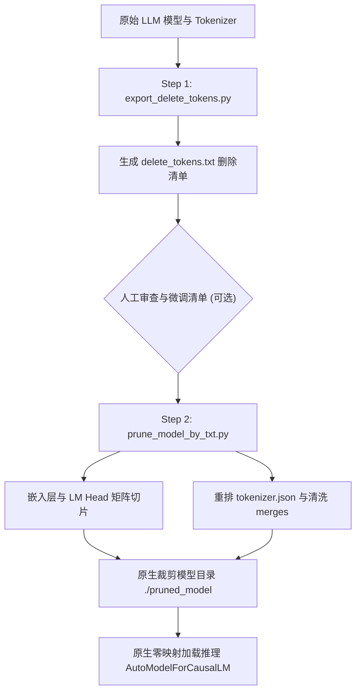

# ✂️ LLM Vocabulary & Embedding Pruner (大语言模型词表与 Embedding 精简裁剪工具)

[](https://www.python.org/downloads/)
[](https://pytorch.org/)
[](https://huggingface.co/docs/transformers/)
[](LICENSE)

一个高效率、高灵活性且**免运行时映射**的大语言模型（LLM）词表与 Embedding 显存瘦身工具。

通过智能识别并精简模型巨额词表中无用的非目标语言 Token（如法语、阿拉伯语、西里尔字母等），同步对模型 `Embedding` 矩阵与 `LM Head` 矩阵进行物理切片组合，并重排清洗 `tokenizer.json` 与 BPE `merges` 规则，导出可直接加载的原生模型。

---

## 🌟 核心特性 (Key Features)

- ⚡ **显存与模型瘦身**：直接消除 50M ~ 250M 冗余矩阵参数，模型文件与显存占用减少 **15% ~ 60%**（在 Gemma / Qwen2.5 等大词表模型上效果尤为惊人）。
- 🎯 **对话能力零损伤**：Transformer 核心主干层（Self-Attention & MLP）100% 原样保留，目标语言（中/英对话）效果完全无损。
- 🔍 **显式 2-Step 人机协同工作流**：
  1. **分析导出**：自动扫描词表并将拟删除的 Token 导出至可读的 `delete_tokens.txt`；
  2. **人工审计**：随时手动检查与微调删除清单；
  3. **模型裁剪**：读取清单并自动切片导出原生新模型。
- 🚀 **原生免映射**：裁剪后导出的模型自带完整的 Tokenizer 索引与规则，直接支持 `AutoTokenizer` 与 `AutoModelForCausalLM` 原生加载，**零运行时映射成本**。
- 🌐 **通用架构兼容**：原生兼容 **Qwen 2.5/3.5**、**Gemma 2/3**、**Llama 3**、**Mistral** 等主流开源 LLM 架构（同时支持 Tied 与 Untied Embedding）。

---

## 📊 效果对比 (Benchmark)

以 **Qwen2.5-0.5B-Instruct** 为例：

| 指标 | 裁剪前 (Original) | 裁剪后 (Pruned) | 瘦身效果 |
| :--- | :--- | :--- | :--- |
| **词表大小 (Vocab Size)** | 151,936 | **136,388** | 剪除 15,548 个非目标 Token |
| **Embedding 参数量** | 136.13 M | **122.20 M** | **削减 13.93 M 参数** |
| **模型总参数量** | 494.03 M | **480.10 M** | 体积直接减少 |
| **中文生成能力** | 100% | **100% (流畅正常)** | **零损失** |

*注：在词表高达 256,000 的 **Gemma-3-270M / Gemma-2B** 模型上，裁剪可削减 **超 50% 以上** 的全模型参数量！*

---

## 🛠️ 工作流与原理 (Architecture)



---

## 🚀 快速开始 (Quick Start)

所有脚本均内置了智能默认参数，您可以直接零参数运行，也可以通过命令行参数自定义模型与路径。

### 环境准备
```bash
pip install -r requirements.txt
```

### 步骤 1：导出待删除 Token 清单
直接运行（自动使用默认模型 `Qwen/Qwen2.5-0.5B-Instruct`）：
```bash
python3 export_delete_tokens.py
```
*或指定自定义模型名称/本地路径：*
```bash
python3 export_delete_tokens.py --model google/gemma-3-270m --output delete_tokens.txt
```

### 步骤 2：检查清单（可选）
用文本编辑器打开 `delete_tokens.txt`。如果其中某些 Token 您希望保留，只需删除该行即可。

### 步骤 3：执行模型裁剪、导出与自动验证
直接运行（自动读取 `delete_tokens.txt`，切片矩阵并自动跑推理验证）：
```bash
python3 prune_model_by_txt.py
```
*或自定义模型与导出目录：*
```bash
python3 prune_model_by_txt.py \
    --model google/gemma-3-270m \
    --delete_txt delete_tokens.txt \
    --output ./gemma-270m-pruned-model
```

### 步骤 4：加载裁剪后的新模型
导出后的模型可以直接像 Hugging Face 官方模型一样原生加载，无需任何修改：
```python
from transformers import AutoTokenizer, AutoModelForCausalLM

model_path = "./qwen2.5-pruned-by-txt"
tokenizer = AutoTokenizer.from_pretrained(model_path, trust_remote_code=True)
model = AutoModelForCausalLM.from_pretrained(model_path, device_map="auto", trust_remote_code=True)

# 正常对话推理
prompt = "你好，请简单介绍一下你自己。"
inputs = tokenizer(prompt, return_tensors="pt").to(model.device)
outputs = model.generate(**inputs, max_new_tokens=64)
print(tokenizer.decode(outputs[0], skip_special_tokens=True))
```

---

## ⚠️ 关键避坑与安全防护 (Safety & Details)

1. **字节与控制节点保护 (ID < 256)**：必须强制保留前 256 个基础 Byte 节点（如换行符 `\n`、空格 ` `、控制字符），防止 Byte-Level BPE 分词器发生解析崩溃。
2. **特殊 Token 保护**：系统级标记（如 `<|im_start|>`, `<|im_end|>`, `<|endoftext|>`）会被自动识别并 100% 保护。
3. **BPE Merges 规则清洗**：工具会自动剔除 `tokenizer.json` 中指向已被删除 Token 的合并规则，防止出现 `Token out of vocabulary` 报错。

---

## 📄 开源协议 (License)

本项目基于 [MIT License](LICENSE) 协议开源。
