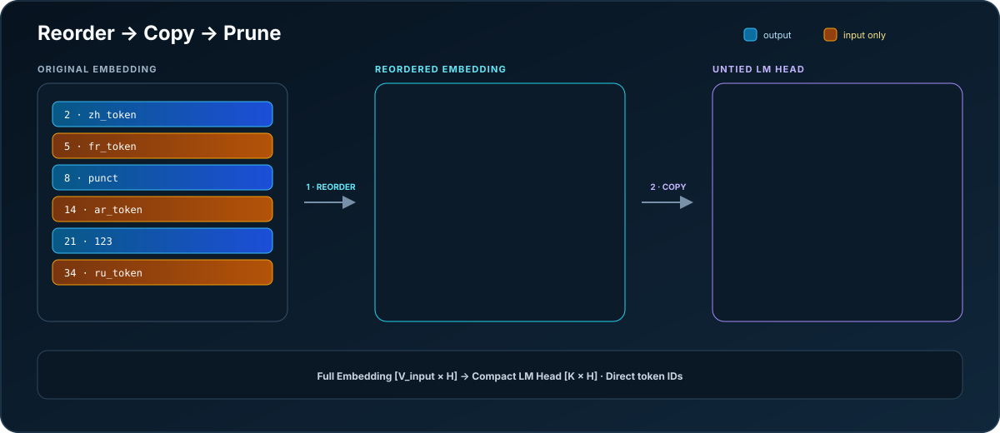

# LLM Reordered Vocabulary Pruner

<p align="center"><strong>保留完整多语种输入词表，将允许输出的 Token 重排为连续前缀，只计算紧凑 LM Head。</strong></p>

<p align="center">
  <a href="https://www.python.org/"></a>
  <a href="https://pytorch.org/"></a>
  <a href="https://huggingface.co/docs/transformers/"></a>
  <a href="LICENSE"></a>
</p>

适用于“**多语种输入、有限目标语言输出**”的 decoder-only 模型。导出时同步重排 tokenizer ID 与完整输入 Embedding，把允许输出的 Token 放入连续前缀 `[0, V_output)`；LM Head 只保留此前缀，推理时直接生成紧凑 ID，不需要运行时映射或完整词表 logits。

<p align="center"><a href="assets/asymmetric-vocab-flow.svg"></a></p>

## 特性

- 完整保留输入 Embedding 行和多语种输入能力。
- LM Head 从 `[V_input, H]` 缩小为 `[V_output, H]`。
- `tie_word_embeddings=false`，输入与输出权重不共享。
- logits 形状为 `[..., V_output]`，没有 `output_token_ids`、scatter 或 `-∞` 扩展。
- 导出目录可由对应的 Transformers AutoModel 类独立加载。

## 支持范围

| 架构 | 状态 | 验证 |
|---|---|---|
| Qwen2 / Qwen2.5 | 支持 | 转换、生成、保存与独立重载 |
| Qwen3 | 支持 | 转换、生成、保存与独立重载 |
| Qwen3.5 | 文本输入支持 | `Qwen3_5ForConditionalGeneration` 文本路径；图像/视频未验证 |
| Gemma 3 text | 支持 | 转换、生成、保存与独立重载 |
| `Qwen/Qwen2.5-0.5B-Instruct` | 真实权重通过 | Embedding、logits、独立 Demo 一致 |
| `Qwen/Qwen3-0.6B` | 真实权重通过 | Embedding、logits、独立 Demo 一致 |
| `Qwen/Qwen3.5-0.8B` | 真实权重文本路径通过 | Embedding、logits、独立 Demo 一致 |
| `google/gemma-3-270m-it` | 真实权重通过 | Embedding、logits、独立 Demo 一致 |
| Gemma 3 multimodal | 暂不支持 | 不支持 `Gemma3ForConditionalGeneration` |
| 其他 decoder-only 模型 | 可扩展 | 需要增加对应适配器和测试 |

## 快速开始

### 1. 安装

```bash
pip install -r requirements.txt
```

### 2. 生成并审核删除清单

Qwen2.5：

```bash
python3 export_delete_tokens.py \
  --model Qwen/Qwen2.5-0.5B-Instruct \
  --output qwen-delete-tokens.txt
```

Qwen3：

```bash
python3 export_delete_tokens.py \
  --model Qwen/Qwen3-0.6B \
  --output qwen3-delete-tokens.txt
```

Qwen3.5（文本输入路径）：

```bash
python3 export_delete_tokens.py \
  --model Qwen/Qwen3.5-0.8B \
  --output qwen3.5-delete-tokens.txt
```

Gemma 3 270M：

```bash
python3 export_delete_tokens.py \
  --model google/gemma-3-270m-it \
  --output gemma3-delete-tokens.txt
```

清单使用原模型旧 Token ID。生产使用前必须人工审核，确保目标语言、数字、单位、专名、特殊 Token 和业务符号完整。

### 3. 重排并裁剪

Qwen2.5：

```bash
python3 prune_model_by_txt.py \
  --model Qwen/Qwen2.5-0.5B-Instruct \
  --delete_txt qwen-delete-tokens.txt \
  --output ./qwen2.5-reordered-pruned
```

Qwen3：

```bash
python3 prune_model_by_txt.py \
  --model Qwen/Qwen3-0.6B \
  --delete_txt qwen3-delete-tokens.txt \
  --output ./qwen3-0.6b-reordered-pruned
```

Qwen3.5（文本输入路径）：

```bash
python3 prune_model_by_txt.py \
  --model Qwen/Qwen3.5-0.8B \
  --delete_txt qwen3.5-delete-tokens.txt \
  --output ./qwen3.5-0.8b-reordered-pruned
```

Gemma 3 270M：

```bash
python3 prune_model_by_txt.py \
  --model google/gemma-3-270m-it \
  --delete_txt gemma3-delete-tokens.txt \
  --output ./gemma3-270m-reordered-pruned
```

Gemma 模型需要先在 Hugging Face 接受许可并完成登录。

### 4. 独立推理

```bash
python3 inference_demo.py \
  --model ./qwen3.5-0.8b-reordered-pruned \
  --prompt "Translate into Chinese: Hello world." \
  --disable-thinking
```

直接加载：

```python
from transformers import AutoModelForCausalLM, AutoTokenizer

model_path = "./gemma3-270m-reordered-pruned"
tokenizer = AutoTokenizer.from_pretrained(
    model_path,
    fix_mistral_regex=False,
)
model = AutoModelForCausalLM.from_pretrained(
    model_path,
    device_map="auto",
    trust_remote_code=True,
)

assert model.config.vocab_reordered is True
assert model.config.tie_word_embeddings is False
assert model.get_output_embeddings().weight.shape[0] == model.config.output_vocab_size

inputs = tokenizer("将法语翻译成中文：Bonjour le monde.", return_tensors="pt")
inputs = inputs.to(model.device)
outputs = model.generate(**inputs, max_new_tokens=64)
print(tokenizer.decode(outputs[0], skip_special_tokens=True))
```

## 使用前必读

- 必须使用导出目录中的 **fast tokenizer**，不要指定 `use_fast=False`。
- 旧的预分词 `input_ids`、ID 缓存和按旧 ID 编写的外部生成配置必须重新生成。
- BOS、EOS、PAD 和 forced-generation Token 必须保留。
- 移动模型时必须复制完整导出目录；运行时代码通过 `trust_remote_code=True` 加载，因此只应加载可信目录。
- 本项目不实现 SSD mmap/offload，但导出的重排 Embedding 可直接按新 ID 索引。

## 详细文档

| 文档 | 内容 |
|---|---|
| [裁剪原理](docs/principle.md) | 排列、同步重排、等价性、参数与内存 |
| [兼容性说明](docs/compatibility.md) | tokenizer、特殊 Token、生成处理器、训练边界 |
| [验证报告](docs/validation.md) | 单元测试与 Qwen2/Qwen3/Qwen3.5/Gemma 真实权重端到端结果 |

## 更新日志

仅记录影响模型结构、使用方式或验证范围的重要变化。

| 日期 | 类型 | 重要变化 |
|---|---|---|
| 2026-08-12 | 模型支持 | 增加 Qwen3 与 Qwen3.5 文本路径适配，并在官方 0.6B/0.8B 权重上验证重排、裁剪、保存、独立重载与生成等价性。 |
| 2026-08-07 | 可视化 | 重做算法动画：Token 行实际从交错旧顺序移动到“输出前缀 + 仅输入尾部”，并用一致颜色展示稳定分组。 |
| 2026-08-06 | 架构 | 用 tokenizer/Embedding 同步重排替代 LM Head 后的运行时映射；logits 直接缩小为 `[..., V_output]`。 |
| 2026-08-06 | 工程 | 删除旧映射兼容残留；README 精简为操作入口，原理、兼容性和验证报告迁移到 `docs/`。 |
| 2026-08-05 | 模型支持 | 完成 Qwen2/Qwen2.5 与纯文本 Gemma 3 适配，并在官方 0.5B/270M 权重上验证保存、重载和生成。 |
| 2026-07-23 | Token 筛选 | 增加外语字符、代码/HTML Token 和低频英文 Token 的删除清单生成规则。 |

## 测试

```bash
python3 -m unittest -v \
  tests/test_asymmetric_models.py \
  tests/test_prune_model_by_txt.py
```

## 项目结构

```text
.
├── export_delete_tokens.py       # 生成旧 ID 删除清单
├── prune_model_by_txt.py         # 重排、裁剪、导出和重载验证
├── asymmetric_models.py          # tokenizer 重排与运行时模型适配器
├── inference_demo.py             # 独立推理 Demo
├── assets/
│   └── asymmetric-vocab-flow.svg
├── docs/
│   ├── principle.md
│   ├── compatibility.md
│   └── validation.md
└── tests/
```

## License

[MIT](LICENSE)
